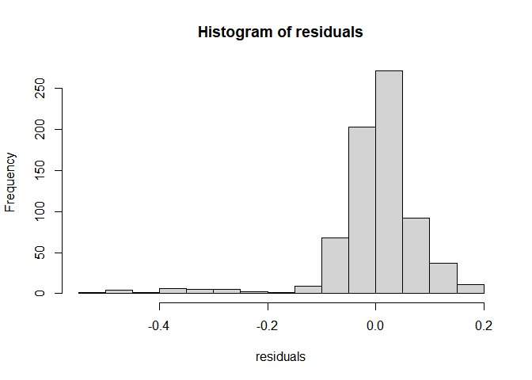
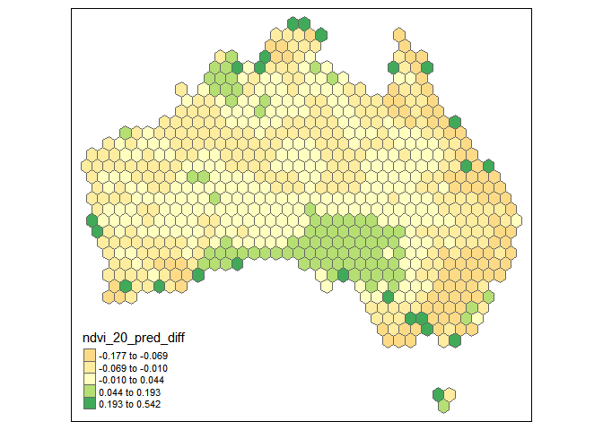

Geog6300: Lab 6
================

## Regression

``` r
library(sf)
library(tidyverse)
library(tmap)
library(lmtest)
library(car)
```

**Overview:** This lab focuses on regression techniques. You’ll be
analyzing the association of various physical and climatological
characteristics in Australia with observations of several animals
recorded on the citizen science app iNaturalist.

\###Data and research questions###

Let’s import the dataset.

``` r
lab6_data<-st_read("data/aus_climate_inat.gpkg")
```

    ## Reading layer `aus_climate_inat' from data source 
    ##   `C:\Users\vijay\OneDrive\Documents\Lab 6\data\aus_climate_inat.gpkg' 
    ##   using driver `GPKG'
    ## Simple feature collection with 716 features and 22 fields
    ## Geometry type: POLYGON
    ## Dimension:     XY
    ## Bounding box:  xmin: 113.875 ymin: -43.38632 xmax: 153.375 ymax: -11.92074
    ## Geodetic CRS:  WGS 84 (CRS84)

The dataset for this lab is a 1 decimal degree hexagon grid that has
aggregate statistics for a number of variables:

- ndvi: NDVI/vegetation index values from Landsat data (via Google Earth
  Engine). These values range from -1 to 1, with higher values
  indicating more vegetation.
- maxtemp_00/20_med: Median maximum temperature (C) in 2000 or 2020
  (data from SILO/Queensland government)
- mintemp_00/20_med: Median minimum temperature (C) in 2020 or 2020
  (data from SILO/Queensland government)
- rain_00/20_sum: Total rainfall (mm) in 2000 or 2020 (data from
  SILO/Queensland government)
- pop_00/20: Total population in 2000 or 2020 (data from NASA’s Gridded
  Population of the World)
- water_00/20_pct: Percentage of land covered by water at some point
  during the year in 2000 or 2020
- elev_med: Median elevation (meters) (data from the Shuttle Radar
  Topography Mission/NASA)

There are also observation counts from iNaturalist for several
distinctively Australian animal species: the central bearded dragon, the
common emu, the red kangaroo, the agile wallaby, the laughing
kookaburra, the wombat, the koala, and the platypus.

Our primary research question is how the climatological/physical
variables in our dataset are predictive of the NDVI value. We will build
models for 2020 as well as the change from 2000 to 2020. The second is
referred to as a “first difference” model and can sometimes be more
useful for identifying causal mechanisms.

\###Part 1: Analysis of 2020 data###

We will start by looking at data for 2020.

**Question 1** *Create histograms for NDVI, max temp., min temp., rain,
and population, and water in 2020 as well as elevation. Based on these
graphs, assess the normality of these variables.*

``` r
hist(lab6_data$ndvi_20_med)
```

<!-- -->

``` r
hist(lab6_data$maxtemp_20_med)
```

<!-- -->

``` r
hist(lab6_data$mintemp_20_med)
```

<!-- -->

``` r
hist(lab6_data$rain_20_sum)
```

<!-- -->

``` r
hist(lab6_data$pop_20)
```

<!-- -->

None of these variables are normally distributed. NDVI and rainfall are
moderately right-skewed, maxtemp and mintemp are moderately left-skewed,
and population is extremely heavily right skewed.

**Question 2** *Use tmap to map these same variables using Jenks natural
breaks as the classification method. For an extra challenge, use
`tmap_arrange` to plot all maps in a single figure.*

``` r
tm_shape(lab6_data)+
  tm_polygons("ndvi_20_med", style = "jenks")
```

<!-- -->

``` r
tm_shape(lab6_data)+
  tm_polygons("maxtemp_20_med", style = "jenks")
```

<!-- -->

``` r
tm_shape(lab6_data)+
  tm_polygons("mintemp_20_med", style = "jenks")
```

<!-- -->

``` r
tm_shape(lab6_data)+
  tm_polygons("rain_20_sum", style = "jenks")
```

<!-- -->

``` r
tm_shape(lab6_data)+
  tm_polygons("pop_20", style = "jenks")
```

<!-- -->

**Question 3** *Based on the maps from question 3, summarise major
patterns you see in the spatial distribution of these data from any of
your variables of interest. How do they appear to be associated with the
NDVI variable?*

NDVI values are highest along the southeast coast and Tasmania and still
very high along the northwest, northern, and southwestern coasts NDVI
values very low across most of Australia, corresponding to the massive
Outback which takes up most of its landmass. Rainfall seems to be
strongly correlated to the NDVI values, with the southwestern coast
seeming to be an outlier in having low rainfall but high NDVI values.
And while most areas with high NDVI values have low population, all
areas of high population are found in areas with high NDVI values, while
no areas with low NDVI values have a high population. Maxtemp and
mintemp are only slightly correlated with NDVI. The primary factor at
play there appears to be that northern areas (those closest to the
equator) are warmer, with NDVI being correlated with slightly moderated
temperatures when comparing across areas at the same latitude.

**Question 4** *Create univariate models for each of the variables
listed in question 1, with NDVI in 2020 as the dependent variable. Print
a summary of each model. Write a summary of those results that indicates
the direction, magnitude, and significance for each model coefficient.*

``` r
dependent_var<-"ndvi_20_med"
independent_vars<-c("maxtemp_20_med", "mintemp_20_med", "rain_20_sum", "pop_20")

models<-list()
summaries<-list()

for(var in independent_vars){
  formula<-as.formula(paste(dependent_var, "~", var))
  
  model<-lm(formula, data = lab6_data)
  models[[var]]<-model
  summaries[[var]]<-summary(model)
  
  cat("\nModel for", var, ":\n")
  print(summaries[[var]])
}
```

    ## 
    ## Model for maxtemp_20_med :
    ## 
    ## Call:
    ## lm(formula = formula, data = lab6_data)
    ## 
    ## Residuals:
    ##      Min       1Q   Median       3Q      Max 
    ## -0.41874 -0.07657 -0.01927  0.06833  0.36382 
    ## 
    ## Coefficients:
    ##                  Estimate Std. Error t value Pr(>|t|)    
    ## (Intercept)     0.6612389  0.0294372   22.46   <2e-16 ***
    ## maxtemp_20_med -0.0130902  0.0009601  -13.63   <2e-16 ***
    ## ---
    ## Signif. codes:  0 '***' 0.001 '**' 0.01 '*' 0.05 '.' 0.1 ' ' 1
    ## 
    ## Residual standard error: 0.1251 on 714 degrees of freedom
    ## Multiple R-squared:  0.2066, Adjusted R-squared:  0.2055 
    ## F-statistic: 185.9 on 1 and 714 DF,  p-value: < 2.2e-16
    ## 
    ## 
    ## Model for mintemp_20_med :
    ## 
    ## Call:
    ## lm(formula = formula, data = lab6_data)
    ## 
    ## Residuals:
    ##      Min       1Q   Median       3Q      Max 
    ## -0.36375 -0.08418 -0.03047  0.06972  0.40383 
    ## 
    ## Coefficients:
    ##                 Estimate Std. Error t value Pr(>|t|)    
    ## (Intercept)     0.464461   0.018997   24.45   <2e-16 ***
    ## mintemp_20_med -0.012282   0.001131  -10.86   <2e-16 ***
    ## ---
    ## Signif. codes:  0 '***' 0.001 '**' 0.01 '*' 0.05 '.' 0.1 ' ' 1
    ## 
    ## Residual standard error: 0.1301 on 714 degrees of freedom
    ## Multiple R-squared:  0.1418, Adjusted R-squared:  0.1406 
    ## F-statistic:   118 on 1 and 714 DF,  p-value: < 2.2e-16
    ## 
    ## 
    ## Model for rain_20_sum :
    ## 
    ## Call:
    ## lm(formula = formula, data = lab6_data)
    ## 
    ## Residuals:
    ##      Min       1Q   Median       3Q      Max 
    ## -0.56681 -0.04753 -0.01210  0.04599  0.30930 
    ## 
    ## Coefficients:
    ##              Estimate Std. Error t value Pr(>|t|)    
    ## (Intercept) 1.303e-01  7.060e-03   18.45   <2e-16 ***
    ## rain_20_sum 9.124e-07  3.953e-08   23.08   <2e-16 ***
    ## ---
    ## Signif. codes:  0 '***' 0.001 '**' 0.01 '*' 0.05 '.' 0.1 ' ' 1
    ## 
    ## Residual standard error: 0.1063 on 714 degrees of freedom
    ## Multiple R-squared:  0.4273, Adjusted R-squared:  0.4265 
    ## F-statistic: 532.6 on 1 and 714 DF,  p-value: < 2.2e-16
    ## 
    ## 
    ## Model for pop_20 :
    ## 
    ## Call:
    ## lm(formula = formula, data = lab6_data)
    ## 
    ## Residuals:
    ##      Min       1Q   Median       3Q      Max 
    ## -0.47003 -0.07883 -0.03949  0.06384  0.48974 
    ## 
    ## Coefficients:
    ##              Estimate Std. Error t value Pr(>|t|)    
    ## (Intercept) 2.552e-01  5.013e-03  50.902   <2e-16 ***
    ## pop_20      1.500e-06  1.500e-07   9.998   <2e-16 ***
    ## ---
    ## Signif. codes:  0 '***' 0.001 '**' 0.01 '*' 0.05 '.' 0.1 ' ' 1
    ## 
    ## Residual standard error: 0.1316 on 714 degrees of freedom
    ## Multiple R-squared:  0.1228, Adjusted R-squared:  0.1216 
    ## F-statistic: 99.97 on 1 and 714 DF,  p-value: < 2.2e-16

The directions and magnitude for each univariate model were shown in the
coefficients, better described as the slope of the linear equation. The
coefficients for the min and max temperature correlations were negative
(-0.012 and -0.013 respectively), while rainfall and population had much
smaller positive coefficients (9.124 x 10^-7 and 1.500 x 10^6
respectively). Because NDVI values only range from -1 to 1, these
correlations have a larger magnitude than it appears, but they are still
relatively small.

The correlation strength for each uni variate model varied widely. The
strongest correlation by far was between rainfall and NDVI (Rsq = 0.43),
with the weakest being between population and NDVI (Rsq = 0.12).
Interestingly, max temp and NDVI had a stronger correlation than min
temp and NDVI (Rsq = 0.21 and Rsq = 0.14, respectively). Additionally,
all coefficients across all correlations were shown as highly
significant as shown by the significance codes.

**Question 5** *Create a multivariate regression model with the
variables of interest, choosing EITHER max or min temperature (but not
both) You may also choose to leave out any variables that were
insignificant in Q4. Use the univariate models as your guide. Call the
results.*

``` r
dependent_var1<-"ndvi_20_med"
independent_vars1<-c("maxtemp_20_med", "rain_20_sum", "pop_20")

formula1<-as.formula(paste(dependent_var, "~", paste(independent_vars, collapse = " + ")))
multivar_model<-lm(formula1, data = lab6_data)
summary(multivar_model)
```

    ## 
    ## Call:
    ## lm(formula = formula1, data = lab6_data)
    ## 
    ## Residuals:
    ##      Min       1Q   Median       3Q      Max 
    ## -0.51714 -0.02470  0.00657  0.03876  0.25738 
    ## 
    ## Coefficients:
    ##                  Estimate Std. Error t value Pr(>|t|)    
    ## (Intercept)     2.569e-01  4.219e-02   6.089 1.86e-09 ***
    ## maxtemp_20_med  7.287e-03  3.026e-03   2.408   0.0163 *  
    ## mintemp_20_med -2.239e-02  3.459e-03  -6.471 1.81e-10 ***
    ## rain_20_sum     1.013e-06  3.984e-08  25.418  < 2e-16 ***
    ## pop_20          2.374e-07  1.052e-07   2.256   0.0244 *  
    ## ---
    ## Signif. codes:  0 '***' 0.001 '**' 0.01 '*' 0.05 '.' 0.1 ' ' 1
    ## 
    ## Residual standard error: 0.0848 on 711 degrees of freedom
    ## Multiple R-squared:  0.6371, Adjusted R-squared:  0.6351 
    ## F-statistic: 312.1 on 4 and 711 DF,  p-value: < 2.2e-16

**Question 6** *Summarize the results of the multivariate model. What
are the direction, magnitude, and significance of each coefficient? How
did it change from the univariate models you created in Q4 (if at all)?
What do the R2 and F-statistic values tell you about overall model fit?*

The multivariate model shows a positive coefficient for all variables
except min temp. However, magnitudes for annual rainfall and population
are quite small, with an order of magnitude at or below 10^-6.
Magnitudes for max temp and min temp are larger, with magnitues of 10^-3
and 10^-2, respectively. The F-statistic value of 312.1 and the p-value
of less than 2.2 x 10^-16 shows that the model is useful, and the
R-squared value of 0.64 tells us that about 64% of the variance in the
data is explained by our model.

**Question 7** *Use a histogram and a map to assess the normality of
residuals and any spatial autocorrelation. Summarise any notable
patterns that you see.*

``` r
residuals<-residuals(multivar_model)
hist(residuals)
```

<!-- -->

``` r
lab6_data<-lab6_data %>%
  mutate(ndvi_20_med_pred = predict(multivar_model)) %>%
  mutate(ndvi_20_pred_diff = ndvi_20_med_pred - ndvi_20_med)

tm_shape(lab6_data)+
  tm_polygons("ndvi_20_pred_diff", style = "jenks")
```

    ## Variable(s) "ndvi_20_pred_diff" contains positive and negative values, so midpoint is set to 0. Set midpoint = NA to show the full spectrum of the color palette.

<!-- -->

The residuals appear strongly left-skewed. The model seems to
underpredict NDVI values along the eastern coast of Australia and in
Tasmania, overpredict in clusters of southern and northwestern
Australia, and accurately predict in most of the country.

**Question 8** *Assess any issues with multicollinearity or
heteroskedastity in this model using the techniques shown in class. Run
the appropriate tests and explain what their results show you.*

``` r
vif(multivar_model)
```

    ## maxtemp_20_med mintemp_20_med    rain_20_sum         pop_20 
    ##      21.624150      22.045570       1.596303       1.184057

``` r
bptest(multivar_model)
```

    ## 
    ##  studentized Breusch-Pagan test
    ## 
    ## data:  multivar_model
    ## BP = 106.96, df = 4, p-value < 2.2e-16

The vif test for multicollinearity shows that total rainfall and
population should be included in our model, while max temp and min temp
should not. This is because the values for the first two variables were
below 5, while the values for the other two were far above 5. The
Breusch-Pagan test shows a p-value of 2.2 x 10^-16, which is well below
the p = 0.05 value required to overturn the null hypothesis that the
data are not heteroskedastic. This means we can conclude that the data
do not follow constant variance, making our model unreliable.

**Question 9** *How would you summarise the results of this model in a
sentence or two? In addition, looking at the full model and your
diagnostics, do you feel this is a model that provides meaningful
results? Explain your answer.*

The results of this model show that max temp and min temp have the
highest influence on the NDVI prediction value, but these variables also
have vif values well above 5, making them unsuitable for use in our
model. Despite this, our model explains about 64% of the variance in the
data, with reasonably good predicitions for much of Australia. However,
underprediction and overprediction seem to be concentrated in specific
areas, begging the question of whether more or different variables are
needed to create an accurate model of NDVI values for Australia. Based
on this information, I do not think the results of this model are
especially meaningful.

**Disclosure of assistance:** *Besides class materials, what other
sources of assistance did you use while completing this lab? These can
include input from classmates, relevant material identified through web
searches (e.g., Stack Overflow), or assistance from ChatGPT or other AI
tools. How did these sources support your own learning in completing
this lab?*

I received help from a friend on questions 7 and 8 concerning concepts,
and help from ChatGPT on questions 4 and 5 with debugging.

**Lab reflection:** *How do you feel about the work you did on this lab?
Was it easy, moderate, or hard? What were the biggest things you learned
by completing it?*

I do not feel confident about my work on this lab, as I was confused by
a number of key concepts such as heteroskedacisity, and Breusch-Pagan
tests.

**Challenge question**

\#Option 1 Create a first difference model. To do that, subtract the
values in 2000 from the values in 2020 for each variable for which that
is appropriate. Then create a new model similar to the one you created
in question 5, but using these new variables showing the *change in
values* over time. Call the results of the model, and interpret the
results in the same ways you did above. Also chart and map the residuals
to assess model error. Finally, write a short section that summarises
what, if anything, this model tells you.

\#Option 2 The animal data included in this dataset is an example of
count data, and usually we would use a Poisson or similar model for that
purpose. Let’s try it with regular OLS regression though. Create two
regression models to assess how the counts of two different animals
(say, koalas and emus) are associated with at least three of the
environmental/climatological variables given above. Be sure to use the
same independent variables in each model. Interpret the results of each
model and then explain the importance of any differences in the model
coefficients between them, focusing on direction, magnitude, and
significance.
